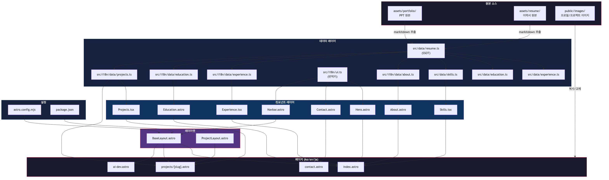
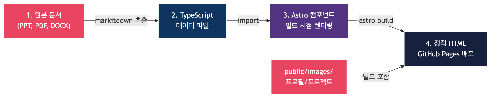

# 포트폴리오 마이그레이션 설계문서

김강남(AI Engineer) 포트폴리오를 장정빈(Cloud Infra / AI Service / Technical Consulting) 포트폴리오로 마이그레이션한다. 사이트의 디자인과 구조를 유지하고, 콘텐츠만 교체한다.

## 1. 목적

### 해결하려는 문제

기존 `kangnam7654.github.io` 포트폴리오의 Astro 6 + React + Tailwind CSS 4 구조를 재활용한다. 장정빈의 경력, 프로젝트, 기술스택 데이터로 내용을 교체한다.

### 성공 기준

- 장정빈의 모든 경력(5개), 프로젝트(8개), 기술스택이 정상 표시된다
- 3개 국어(한국어, 영어, 일본어) 번역이 정상 동작한다
- `astro build` 명령이 에러 없이 완료된다
- 김강남의 개인정보(이름, 이메일, 전화, GitHub)가 사이트 어디에도 남아 있지 않다

## 2. 전제 조건

이 문서를 읽고 작업을 수행하려면 아래 지식과 도구가 필요하다.

### 필수 지식

- **Astro 프레임워크**: 정적 사이트 생성(SSG) 방식의 웹 프레임워크. 파일 기반 라우팅을 사용한다
- **React**: UI 컴포넌트 라이브러리. 이 프로젝트에서 인터랙티브 컴포넌트에 사용한다
- **TypeScript**: 타입이 있는 JavaScript. 데이터 파일과 컴포넌트에 사용한다
- **Tailwind CSS 4**: 유틸리티 기반 CSS 프레임워크
- **i18n(국제화)**: 하나의 콘텐츠를 여러 언어로 제공하는 기법

### 필수 도구

| 도구 | 최소 버전 | 용도 |
|------|----------|------|
| Node.js | 22.12.0+ | Astro 빌드 런타임 |
| npm | 10+ | 패키지 관리 |
| Git | 2.x | 버전 관리 |
| Git LFS | 3.x | 대용량 파일(mp4) 관리 |

## 3. 아키텍처

기존 아키텍처를 변경하지 않는다. Astro 6, React, Tailwind CSS 4, Framer Motion 스택을 그대로 유지한다. i18n 구조(ko/en/ja)도 동일하게 유지한다.

### 컴포넌트 관계 다이어그램



데이터는 이중 구조로 관리한다.

- **`/src/data/`**: 이력서 생성용 한국어 단일 데이터 (SSOT, Single Source of Truth)
- **`/src/i18n/data/`**: 사이트 표시용 3개 국어 데이터

`src/data/resume.ts`가 SSOT(데이터의 단일 원천) 역할을 한다. 이 파일의 내용을 기반으로 나머지 데이터 파일을 작성한다.

### 변경되는 설정값

```typescript
// astro.config.mjs
site: 'https://jeongbaaaan.github.io'  // 기존: kangnam7654.github.io

// package.json
"name": "jeongbaaaan-portfolio"  // 기존: astro-portfolio-init
```

## 4. 데이터 흐름

원본 문서에서 배포까지 4단계를 거친다.



### 단계별 설명

**단계 1: 원본 문서에서 내용 추출**

`assets/` 디렉토리의 PPT, PDF, DOCX 파일에서 markitdown으로 텍스트를 추출한다.

```bash
# markitdown으로 PPT에서 텍스트 추출
uv run python -c "from markitdown import MarkItDown; md = MarkItDown(); print(md.convert('assets/portfolio/portfolio.pptx').text_content)"
```

**단계 2: TypeScript 데이터 파일로 변환**

추출한 내용을 `src/data/` 및 `src/i18n/data/` 디렉토리의 TypeScript 파일에 입력한다. 영어와 일본어 번역도 이 단계에서 작성한다.

**단계 3: Astro 컴포넌트가 데이터를 읽어 렌더링**

Astro 컴포넌트가 빌드 시점에 TypeScript 데이터 파일을 import하여 HTML을 생성한다.

**단계 4: 정적 HTML 생성 및 배포**

`astro build` 명령으로 정적 HTML을 생성한다. GitHub Actions가 GitHub Pages로 배포한다.

```bash
npm run build  # dist/ 디렉토리에 정적 파일 생성
```

## 5. 장정빈 프로필 정보

마이그레이션에 사용할 원본 데이터를 아래에 정리한다. 이 데이터를 TypeScript 파일에 입력한다.

### 5.1 기본 정보

| 항목 | 값 |
|------|---|
| 이름 | 장정빈 |
| 타이틀 | Cloud Infra / AI Service / Technical Consulting |
| 슬로건 | "기술과 고객 사이에서 문제를 풀어갑니다" |
| 이메일 | apple22by33@naver.com |
| 전화 | +82-10-8550-8464 |
| 블로그 | substack.com/@bitbit1 |
| GitHub | jeongbaaaan |
| LinkedIn | 확인 필요 (없으면 제거) |

### 5.2 학력

| 학교 | 전공/과정 | 비고 |
|------|----------|------|
| 가천대학교 | 경제학과 (3.6/4.5) | |
| Oklahoma State University | 교환학생 | |

### 5.3 자격증

| 자격증 | 취득일 |
|--------|--------|
| AWS SAA (Solutions Architect Associate) | 2024.07 |
| ADsP (Advanced Data Analytics Semi-Professional) | 2023.11 |
| OPIc IH (Intermediate High) | 2024.04 |
| AWS Hackathon 대상 1위 | 2024.02 |

AWS Official Training 6개를 추가로 표시한다.

- Serverless
- DevOps
- Developing
- Well-Architected
- Technical Essentials
- Security Essentials

### 5.4 경력 타임라인 (5개)

**1. 스마일샤크 (2024.11 ~ 현재) - Account Manager**

AWS MSP(Managed Service Provider, AWS 관리형 서비스 파트너) 파트너사이다.

- 70+ 고객 계정 AWS 인프라 관리 (EC2, S3, RDS, Lambda, CloudFront)
- QR 이미지 Lambda 리사이징 아키텍처 설계 (스토리지 60% 절감)
- Cost Explorer 분석 후 RI(Reserved Instance, 예약 인스턴스) 전환 권고
- S3 Lifecycle 정책 최적화
- 신규 고객사 PoC 기획 (Well-Architected 기반)

**2. 네이버클라우드 Clova X (2023.11 ~ 2023.12) - AI PM**

- 프롬프트 데이터셋 구축 (Few-shot 기반)
- UX 흐름 설계, 사용자 시나리오 작성
- 기획 문서를 API 스펙으로 변환하여 개발팀과 협업
- 수정 사이클 3회에서 1회로 단축 (66% 감소)

**3. AWS CloudSchool 4기 (2024.01 ~ 2024.07) - 부팀장/DB 리더**

- CQRS(Command Query Responsibility Segregation, 명령-조회 분리) 경매 웹사이트 설계
- Multi-AZ(다중 가용 영역) 고가용성 구성
- 처리량 2배 향상, 비용 30% 절감
- AWS 해커톤 대상 (1위)

**4. 신한은행 (2023.09) - 기업뱅킹 IT기획**

**5. Dear,ANT (2025.03) - 개인 프로젝트**

AI 투자 판단 리포트 서비스이다. Claude Code로 1인 2주 End-to-End 개발을 수행했다.

- 기술스택: Next.js 16, TypeScript, React 19, Tailwind CSS 4, Supabase

### 5.5 기술 스택

| 카테고리 | 기술 |
|---------|------|
| Cloud | AWS (EC2, S3, Lambda, RDS, CloudFront, Cost Explorer), Docker, Linux |
| Dev | Next.js, TypeScript, React, Python, JavaScript |
| DB | Supabase (PostgreSQL), MySQL, CQRS |
| Tools | Docker, Linux, JIRA, Figma, Notion |

### 5.6 프로젝트 목록 (8개)

#### 회사 프로젝트 (3개)

| slug | 프로젝트명 | 회사 | 설명 |
|------|----------|------|------|
| `cloud-infra-management` | 클라우드 인프라 관리 & 비용 최적화 | 스마일샤크 | AWS MSP 기반 70+ 고객 인프라 관리 |
| `clova-x-chatbot` | Clova X AI 챗봇 PM | 네이버클라우드 | 프롬프트 데이터셋 구축, UX 설계 |
| `shinhan-banking` | 기업뱅킹 IT기획 | 신한은행 | 기업뱅킹 IT 기획 업무 |

#### 교육 프로젝트 (3개)

| slug | 프로젝트명 | 과정 | 설명 |
|------|----------|------|------|
| `cloud-native-auction` | CQRS 경매 웹사이트 | AWS CloudSchool | 해커톤 대상, Multi-AZ 고가용성 |
| `kubernetes-service` | Kubernetes 프로젝트 | AWS CloudSchool | Kubernetes 기반 서비스 |
| `python-data-viz` | Python 데이터 시각화 | AWS CloudSchool | 데이터 분석 및 시각화 |

#### 사이드/해커톤 프로젝트 (2개)

| slug | 프로젝트명 | 기술 | 설명 |
|------|----------|------|------|
| `dear-ant` | AI 투자 판단 리포트 | Next.js, Supabase | Claude Code로 1인 2주 개발 |
| `ttona` | 또나 AI 부캐 챗봇 | - | Potenday 312 해커톤, PM 역할 |

## 6. 수정 대상 파일 구조

마이그레이션 대상 파일의 전체 경로를 아래 tree로 표시한다.

```text
jeongbaaaan.github.io/
├── astro.config.mjs                     # site URL 교체
├── package.json                         # 프로젝트명 교체
├── CLAUDE.md                            # 프로젝트 컨텍스트 업데이트
├── src/
│   ├── i18n/
│   │   ├── ui.ts                        # 전체 번역키 교체 (이름, 역할, 네비 등)
│   │   └── data/
│   │       ├── about.ts                 # 자기소개 3문단 x 3개 국어
│   │       ├── experience.ts            # 경력 5개 x 3개 국어
│   │       ├── education.ts             # 학력/자격증 x 3개 국어
│   │       └── projects.ts              # 프로젝트 8개 x 3개 국어 (contentHtml 포함)
│   ├── data/
│   │   ├── resume.ts                    # 이력서 SSOT 전체 교체
│   │   ├── experience.ts                # 경력 교체
│   │   ├── education.ts                 # 학력/자격증 교체
│   │   └── skills.ts                    # 스킬 카테고리 교체
│   ├── components/
│   │   ├── sections/
│   │   │   ├── Projects.tsx             # 인라인 projectsData 배열 교체
│   │   │   └── Contact.astro            # 이메일, 전화, GitHub, 블로그 링크 교체
│   │   └── layout/
│   │       └── Navbar.astro             # 프로젝트 네비 목록, 소셜 링크 교체
│   ├── layouts/
│   │   └── BaseLayout.astro             # siteUrl 변수 교체
│   └── pages/
│       ├── ai-dev.astro                 # 내용 교체 또는 제거
│       ├── en/ai-dev.astro              # 내용 교체 또는 제거
│       ├── ja/ai-dev.astro              # 내용 교체 또는 제거
│       └── projects/
│           └── [slug].astro             # getStaticPaths는 자동 (projects.ts 의존)
├── public/
│   └── images/
│       ├── profile.jpg                  # 장정빈 프로필 사진으로 교체
│       ├── og-image.png                 # OG 이미지 교체 (추후)
│       └── projects/                    # 기존 이미지 전부 제거, 필요시 새 이미지 추가
```

## 7. Phase별 작업 상세

6개 Phase로 나누어 순서대로 진행한다. 각 Phase는 독립적으로 빌드 가능한 상태를 유지한다.

### Phase 1: 기본 설정 & 프로필

사이트 URL과 기본 프로필 정보를 교체한다.

#### 7.1.1 `astro.config.mjs`

```typescript
// Before
site: 'https://kangnam7654.github.io'

// After
site: 'https://jeongbaaaan.github.io'
```

#### 7.1.2 `package.json`

```json
{
  "name": "jeongbaaaan-portfolio"
}
```

#### 7.1.3 `src/i18n/ui.ts`

모든 번역키를 교체한다. 주요 변경 항목은 아래와 같다.

```typescript
// ko 섹션 주요 변경
"hero.name": "장정빈",
"hero.role": "Cloud Infra · AI Service · Technical Consulting",
"hero.profileAlt": "장정빈 프로필 사진",
"hero.typewriter.1": "AWS · Cloud Infra · Cost Optimization",
"hero.typewriter.2": "기술과 고객 사이에서 문제를 풀어갑니다",
"hero.typewriter.3": "AI Service · Technical Consulting",
"hero.typewriter.4": "End-to-End 서비스 기획부터 운영까지",

// nav.project.* 키 전체를 장정빈 프로젝트 8개로 교체
"nav.project.cloudInfra": "클라우드 인프라 관리",
"nav.project.clovaX": "Clova X 챗봇 PM",
"nav.project.shinhan": "기업뱅킹 IT기획",
"nav.project.auction": "CQRS 경매 웹사이트",
"nav.project.kubernetes": "Kubernetes 프로젝트",
"nav.project.dataViz": "데이터 시각화",
"nav.project.dearAnt": "Dear,ANT",
"nav.project.ttona": "또나 AI 챗봇",

// layout 관련
"layout.defaultDescription": "장정빈 - Cloud Infra · AI Service 포트폴리오",
"layout.ogSiteName": "장정빈 포트폴리오",
"layout.pageTitle": "장정빈 | Cloud Infra · AI Service",
"footer.copyright": "장정빈",
```

영어(en)와 일본어(ja) 섹션도 동일한 구조로 번역한다.

기존 김강남 전용 키(`nav.project.ue5Mcp`, `nav.project.aiAssessment` 등 15개)를 모두 제거한다. 장정빈 프로젝트 8개에 대응하는 새 키로 교체한다.

#### 7.1.4 `src/layouts/BaseLayout.astro`

```typescript
// Before
const siteUrl = "https://kangnam7654.github.io";

// After
const siteUrl = "https://jeongbaaaan.github.io";
```

#### 7.1.5 이미지 교체

- `public/images/profile.jpg`: 장정빈 프로필 사진으로 교체
- `public/images/og-image.png`: 새 OG 이미지로 교체 (추후)
- `public/images/projects/` 내 기존 이미지 전부 제거

### Phase 2: 데이터 파일 교체

이력서 SSOT와 다국어 데이터 파일을 교체한다.

#### 7.2.1 `src/data/resume.ts`

SSOT 파일을 전면 교체한다. 아래는 교체 후 구조의 예시이다.

```typescript
export const profile = {
  name: "장정빈",
  title: "Cloud Infra · AI Service · Technical Consulting",
  birth: "",  // 미공개시 빈 문자열
  address: "",
  portfolio: "jeongbaaaan.github.io",
  salary: { current: "", desired: "" },
};

export const summary = [
  "AWS MSP 파트너사에서 70+ 고객 계정의 클라우드 인프라를 관리하고 비용을 최적화하는 Account Manager입니다.",
  "네이버클라우드 Clova X에서 AI PM으로 프롬프트 데이터셋을 구축하고 UX 흐름을 설계한 경험이 있습니다.",
  "AWS CloudSchool 해커톤 대상(1위) 수상 경력이 있으며, Claude Code를 활용한 1인 풀스택 개발도 수행합니다.",
];

export const skills = {
  "Cloud": "AWS (EC2, S3, Lambda, RDS, CloudFront, Cost Explorer), Docker, Linux",
  "Dev": "Next.js, TypeScript, React, Python, JavaScript",
  "DB": "Supabase (PostgreSQL), MySQL, CQRS",
  "Tools": "Docker, Linux, JIRA, Figma, Notion",
};

export const career: CareerEntry[] = [
  {
    company: "스마일샤크",
    role: "Account Manager",
    team: "AWS MSP",
    period: "2024.11 – 현재",
    location: "",
    project: "클라우드 인프라 관리 & 비용 최적화",
    highlights: [
      "70+ 고객 계정 AWS 인프라 관리 (EC2, S3, RDS, Lambda, CloudFront)",
      "QR 이미지 Lambda 리사이징 아키텍처 설계 (스토리지 60% 절감)",
      "Cost Explorer 분석 → RI 전환 권고, S3 Lifecycle 정책 최적화",
      "신규 고객사 PoC 기획 (Well-Architected 기반)",
    ],
  },
  // ... 나머지 4개 경력도 동일 구조로 작성
];

export const education = [
  {
    school: "가천대학교",
    major: "경제학과 (3.6/4.5)",
    period: "",
    location: "",
    details: [],
  },
  {
    school: "Oklahoma State University",
    major: "교환학생",
    period: "",
    location: "",
    details: [],
  },
];

export const certifications = [
  "AWS SAA (Solutions Architect Associate) – 2024.07",
  "ADsP (Advanced Data Analytics Semi-Professional) – 2023.11",
  "OPIc IH (Intermediate High) – 2024.04",
  "AWS Hackathon 대상 1위 – 2024.02",
];
```

#### 7.2.2 `src/data/experience.ts`

`resume.ts`의 career 데이터와 동일한 내용을 `Experience` 인터페이스에 맞춰 작성한다.

#### 7.2.3 `src/data/education.ts`

기존 인터페이스(`Education`, `Certification`, `Thesis`)를 유지한다. 장정빈에게는 석사 논문이 없으므로 `thesis` 필드를 제거한다.

```typescript
export const education: Education[] = [
  {
    school: "가천대학교",
    degree: "경제학과, 학사 (3.6/4.5)",
    period: "",
  },
  {
    school: "Oklahoma State University",
    degree: "교환학생",
    period: "",
  },
];

export const certifications: Certification[] = [
  { name: "AWS SAA (Solutions Architect Associate)", date: "2024.07" },
  { name: "ADsP (Advanced Data Analytics Semi-Professional)", date: "2023.11" },
  { name: "OPIc IH (Intermediate High)", date: "2024.04" },
  { name: "AWS Hackathon 대상 1위", date: "2024.02" },
];
```

#### 7.2.4 `src/data/skills.ts`

기존 7개 카테고리를 4개로 재구성한다.

```typescript
export const skills: SkillCategory[] = [
  {
    title: "Cloud & Infra",
    icon: "☁️",
    items: ["AWS EC2", "S3", "Lambda", "RDS", "CloudFront", "Cost Explorer", "Docker", "Linux"],
    size: "large",
  },
  {
    title: "Development",
    icon: "💻",
    items: ["Next.js", "TypeScript", "React", "Python", "JavaScript"],
    size: "medium",
  },
  {
    title: "Database",
    icon: "🗄️",
    items: ["Supabase", "PostgreSQL", "MySQL", "CQRS"],
    size: "medium",
  },
  {
    title: "Tools & Collaboration",
    icon: "🛠️",
    items: ["JIRA", "Figma", "Notion", "Git", "Claude Code"],
    size: "medium",
  },
];
```

#### 7.2.5 `src/i18n/data/about.ts`

자기소개 3문단을 3개 국어로 작성한다. 장정빈의 강점(클라우드 인프라 관리, AI PM, 기술 컨설팅)을 반영한다.

#### 7.2.6 `src/i18n/data/experience.ts`

경력 5개를 3개 국어로 작성한다. 기존 `Experience` 인터페이스를 유지한다.

#### 7.2.7 `src/i18n/data/education.ts`

학력 2개와 자격증 4개를 3개 국어로 작성한다. `Thesis` 인터페이스는 사용하지 않는다.

### Phase 3: 프로젝트 데이터 교체

가장 분량이 큰 Phase이다. 15개 프로젝트를 8개로 교체한다.

#### 7.3.1 `src/i18n/data/projects.ts`

**projectSlugs 배열 교체:**

```typescript
export const projectSlugs = [
  "cloud-infra-management",
  "clova-x-chatbot",
  "shinhan-banking",
  "cloud-native-auction",
  "kubernetes-service",
  "python-data-viz",
  "dear-ant",
  "ttona",
] as const;
```

**ProjectData 인터페이스 변경:**

기존 `sideProject`, `claudeCode` 플래그 대신 카테고리를 구분하는 새 필드를 추가한다.

```typescript
export interface ProjectData {
  title: string;
  company: string;
  period: string;
  role: string;
  tags: string[];
  github?: string;
  sideProject?: boolean;
  claudeCode?: boolean;
  education?: boolean;    // 새로 추가: 교육 프로젝트 구분용
  contentHtml: string;
}
```

각 프로젝트의 `contentHtml`에 개요, 주요 성과, 기술 스택 섹션을 포함한다. 이미지가 없는 프로젝트는 텍스트 기반으로 구성한다.

**프로젝트별 플래그 매핑:**

| slug | sideProject | claudeCode | education |
|------|------------|------------|-----------|
| `cloud-infra-management` | - | - | - |
| `clova-x-chatbot` | - | - | - |
| `shinhan-banking` | - | - | - |
| `cloud-native-auction` | - | - | true |
| `kubernetes-service` | - | - | true |
| `python-data-viz` | - | - | true |
| `dear-ant` | true | true | - |
| `ttona` | true | - | - |

#### 7.3.2 `src/components/sections/Projects.tsx`

인라인 `projectsData` 배열을 8개 프로젝트로 교체한다. 기존 15개 항목을 모두 제거하고 새 데이터를 입력한다.

```typescript
const projectsData: Record<Locale, Project[]> = {
  ko: [
    {
      title: "클라우드 인프라 관리 & 비용 최적화",
      description: "AWS MSP 기반 70+ 고객 인프라 관리, Lambda 리사이징으로 스토리지 60% 절감",
      tags: ["AWS", "EC2", "Lambda", "Cost Optimization"],
      company: "스마일샤크",
      href: "/projects/cloud-infra-management",
    },
    // ... 나머지 7개
  ],
  en: [ /* 영어 버전 */ ],
  ja: [ /* 일본어 버전 */ ],
};
```

#### 7.3.3 `src/pages/projects/[slug].astro`

`getStaticPaths()`는 `getAllProjectSlugs()`를 호출하므로 자동으로 반영된다. `projects.ts`의 `projectSlugs` 배열만 교체하면 동적 라우트가 새 slug 목록으로 생성된다.

```typescript
// 변경 불필요 - projects.ts의 projectSlugs에 의존
export function getStaticPaths() {
  return getAllProjectSlugs().map((slug) => ({ params: { slug } }));
}
```

`en/projects/[slug].astro`와 `ja/projects/[slug].astro`도 동일한 구조이므로 별도 수정이 필요하지 않다.

### Phase 4: 컴포넌트 & 레이아웃 수정

하드코딩된 연락처 정보와 네비게이션 링크를 교체한다.

#### 7.4.1 `src/components/sections/Contact.astro`

4개 연락처 링크를 교체한다.

| 항목 | 기존값 | 변경값 |
|------|--------|--------|
| 이메일 | kangnam7653@gmail.com | apple22by33@naver.com |
| 전화 | 010-5230-7653 | 010-8550-8464 |
| GitHub | github.com/kangnam7654 | github.com/jeongbaaaan |
| LinkedIn | linkedin.com/in/kangnam7654 | substack.com/@bitbit1 (블로그로 대체) |

LinkedIn을 블로그로 대체할 경우, SVG 아이콘도 블로그 아이콘으로 교체한다.

#### 7.4.2 `src/components/layout/Navbar.astro`

`projectItems` 배열을 8개 프로젝트로 교체한다.

```typescript
const projectItems = [
  { label: t("nav.project.cloudInfra", locale), href: localePath("/projects/cloud-infra-management", locale) },
  { label: t("nav.project.clovaX", locale), href: localePath("/projects/clova-x-chatbot", locale) },
  { label: t("nav.project.shinhan", locale), href: localePath("/projects/shinhan-banking", locale) },
  { label: t("nav.project.auction", locale), href: localePath("/projects/cloud-native-auction", locale) },
  { label: t("nav.project.kubernetes", locale), href: localePath("/projects/kubernetes-service", locale) },
  { label: t("nav.project.dataViz", locale), href: localePath("/projects/python-data-viz", locale) },
  { label: t("nav.project.dearAnt", locale), href: localePath("/projects/dear-ant", locale) },
  { label: t("nav.project.ttona", locale), href: localePath("/projects/ttona", locale) },
];
```

#### 7.4.3 `public/images/projects/`

기존 이미지 파일을 전부 제거한다. 제거 대상 목록은 아래와 같다.

- `ue5-mcp-*.gif` (4개)
- `ai-assessment-*.png` (4개)
- `ftc-*.png` (3개)
- `radar-*.png` (4개)
- `anomaly-detection.gif`
- `game-npc-*.gif`, `game-npc-*.png` (3개)
- `story-writer-ui.png`

장정빈의 프로젝트에 사용할 이미지가 있으면 같은 디렉토리에 추가한다. 이미지가 없는 프로젝트는 `contentHtml`에서 `` 태그를 제거한다.

### Phase 5: 프로젝트 필터 조정

기존 필터 구조를 장정빈의 프로젝트 분류에 맞게 조정한다.

#### 기존 필터

```typescript
// 2중 토글: 회사 / 사이드
"projects.filter.company": "회사",
"projects.filter.side": "사이드",
```

#### 변경 필터

```typescript
// 3중 토글: 회사 / 교육 / 사이드
"projects.filter.company": "회사",
"projects.filter.education": "교육",
"projects.filter.side": "사이드",
```

`Projects.tsx`의 필터 로직에 `education` 플래그를 추가한다. 토글 버튼의 색상 배지도 조정한다.

| 카테고리 | 프로젝트 수 | 배지 색상 |
|---------|-----------|----------|
| 회사 | 3개 | 기본 (블루) |
| 교육 | 3개 | 그린 (신규) |
| 사이드 | 2개 | 에메랄드 (기존 유지) |

`claudeCode` 필터는 해당 프로젝트가 1개(`dear-ant`)뿐이므로 별도 토글을 두지 않는다. `claudeCode` 배지는 카드에 표시하되 필터 기능은 제거한다.

### Phase 6: AI Dev 페이지

기존 `ai-dev.astro` 페이지는 김강남의 "AI와 함께 일하는 시스템" 콘텐츠를 담고 있다.

#### 선택지

**옵션 A: 장정빈 맞춤 콘텐츠로 교체**

장정빈의 AI 활용 역량(Claude Code 활용, Dear,ANT 개발 등)으로 내용을 교체한다. `AiWorkflow.tsx` 컴포넌트의 데이터를 수정한다.

**옵션 B: 페이지 제거**

장정빈의 주요 역량이 클라우드 인프라이므로 AI Dev 페이지가 핵심이 아닐 수 있다. 이 경우 아래 파일을 제거한다.

- `src/pages/ai-dev.astro`
- `src/pages/en/ai-dev.astro`
- `src/pages/ja/ai-dev.astro`
- `src/components/sections/AiDevCta.astro`
- `src/components/sections/AiWorkflow.tsx`

Navbar와 Hero의 AI Dev 관련 링크도 제거한다. `ui.ts`의 AI Dev 관련 번역키도 삭제한다.

**권장: 옵션 A** -- Dear,ANT 프로젝트에서 Claude Code를 활용한 경험이 있으므로, 축소된 형태로 유지하는 것을 권장한다. 최종 결정은 사용자가 내린다.

## 8. 의사결정 근거

### 채택: 기존 구조 유지 + 데이터만 교체

- **이유**: 사이트 디자인과 레이아웃이 완성되어 있다. 사용자가 구조 유지를 요청했다
- **장점**: 작업량을 최소화한다. 검증된 코드(i18n, 애니메이션, 반응형)를 재사용한다

### 기각: 새 프로젝트로 처음부터 구축

- **이유**: 디자인이 동일하므로 코드를 재작성할 이유가 없다
- **위험**: 시간 낭비, 기존 i18n/애니메이션/반응형 작업을 다시 수행해야 한다

### 채택: 프로젝트 15개에서 8개로 축소

- **이유**: 장정빈의 프로젝트 수가 적다. 없는 프로젝트를 억지로 채울 필요가 없다
- **영향**: 프로젝트 그리드 레이아웃이 자동 조정된다. 필터 카테고리도 변경한다

### 채택: 프로젝트 필터를 회사/교육/사이드로 변경

- **이유**: 기존 회사/사이드/Claude Code 3중 분류는 장정빈에게 맞지 않다
- **장점**: 교육 프로젝트(AWS CloudSchool) 3개를 별도 카테고리로 구분하여 가시성을 높인다

### 채택: LinkedIn을 블로그(Substack)로 대체 가능

- **이유**: 장정빈의 LinkedIn 정보가 불명확하다. Substack 블로그는 확인되었다
- **결정**: LinkedIn이 있으면 유지한다. 없으면 블로그 링크로 대체한다

## 9. 주의사항

### 프로젝트 성과 관련 제약

원본 문서에 있는 내용만 사용한다. 성과를 지어내지 않는다.

- 스마일샤크: "스토리지 60% 절감"은 QR 이미지 리사이징 아키텍처 한정
- 네이버클라우드: "수정 사이클 66% 단축"은 기획-개발 협업 프로세스 한정
- AWS CloudSchool: "처리량 2x, 비용 30%"는 CQRS 경매 프로젝트 한정
- 신한은행: 구체적 성과 데이터 없음. 역할 설명만 기재
- Dear,ANT: Claude Code 활용 사실만 기재. 서비스 성과 없음

### 이미지 처리 규칙

- 이미지가 없는 프로젝트는 텍스트 기반으로 `contentHtml`을 구성한다
- 원본에서 추출 불가능한 이미지는 무리하게 추가하지 않는다
- 기존 이미지(김강남 프로젝트)를 장정빈 프로젝트에 재사용하지 않는다
- 새 이미지를 추가할 경우 `public/images/projects/` 디렉토리에 저장한다

### 개인정보 완전 제거 확인

마이그레이션 완료 후, 아래 검색으로 김강남의 개인정보가 남아 있지 않은지 확인한다.

```bash
# 소스 코드에서 김강남 관련 문자열 검색
grep -r "kangnam" src/ --include="*.ts" --include="*.tsx" --include="*.astro"
grep -r "강남" src/ --include="*.ts" --include="*.tsx" --include="*.astro"
grep -r "kangnam7654" . --include="*.mjs" --include="*.json" --include="*.astro"
grep -r "kangnam7653" src/  # 이메일
grep -r "5230-7653" src/    # 전화번호
```

### CLAUDE.md 업데이트

마이그레이션 완료 후 프로젝트 루트의 `CLAUDE.md`를 장정빈 프로젝트 컨텍스트로 업데이트한다. 주요 변경 항목은 아래와 같다.

- 프로젝트명, 타이틀 변경
- 회사 프로젝트 목록 교체 (8개 → 8개)
- 사이드 프로젝트 목록 교체 (7개 → 2개)
- 주의사항 섹션의 프로젝트별 제약 교체

## 10. 트러블슈팅

마이그레이션 중 발생할 수 있는 에러와 해결 방법을 정리한다.

### 에러 1: TypeScript 타입 불일치

`education` 플래그를 `ProjectData` 인터페이스에 추가한 뒤 빌드하면, 기존 프로젝트 데이터에 `education` 필드가 없어 타입 에러가 발생할 수 있다.

```bash
# 에러 메시지 예시
Type '{ title: string; company: string; }' is not assignable to type 'ProjectData'.
```

**해결**: `education` 필드를 optional(`education?: boolean`)로 선언했는지 확인한다. Phase 3의 인터페이스 정의(7.3.1)를 참고한다.

### 에러 2: i18n 번역키 누락으로 빈 텍스트 표시

기존 김강남 프로젝트의 번역키를 제거한 뒤 새 키를 추가하지 않으면, 사이트에서 빈 문자열이 표시된다.

```bash
# 누락된 키 확인 방법
grep -oP 't\("nav\.project\.\w+"' src/components/layout/Navbar.astro | sort > /tmp/used-keys.txt
grep -oP '"nav\.project\.\w+"' src/i18n/ui.ts | sort > /tmp/defined-keys.txt
diff /tmp/used-keys.txt /tmp/defined-keys.txt
```

**해결**: `ui.ts`의 ko, en, ja 3개 섹션 모두에서 사용 중인 모든 키가 정의되어 있는지 확인한다.

### 에러 3: 빌드 시 이미지 404

`contentHtml`에서 ``로 참조하는 이미지가 `public/images/projects/`에 없으면 빌드는 성공하지만 브라우저에서 404가 발생한다.

```bash
# contentHtml에서 참조하는 이미지 목록 추출
grep -oP 'src="/images/projects/[^"]+' src/i18n/data/projects.ts | sort -u
# 실제 존재하는 이미지 목록
ls public/images/projects/
```

**해결**: 두 목록을 비교한다. `contentHtml`에서 참조하는 이미지가 모두 `public/images/projects/`에 존재해야 한다. 이미지가 없는 프로젝트는 `` 태그를 제거한다.

### 에러 4: Phase별 빌드 검증

각 Phase 완료 후 빌드가 깨지지 않았는지 확인한다.

```bash
# 매 Phase 완료 후 실행
npm run build

# 로컬에서 결과 확인
npm run preview
```

빌드 에러가 발생하면 에러 메시지에서 파일 경로와 줄 번호를 확인하고, 해당 파일에서 누락된 import나 잘못된 참조를 수정한다.
